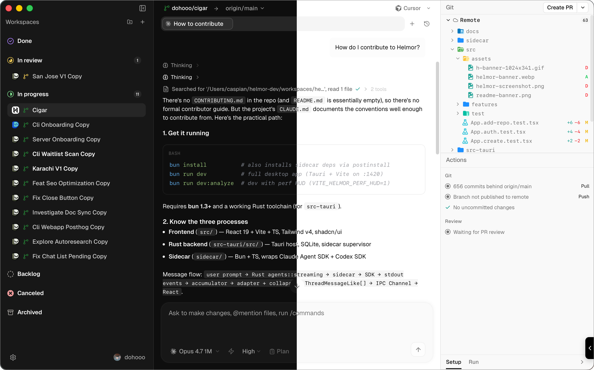

  

<h1 align="center">Pathos</h1>

  Pathos is an open-source local workbench for multi-agent software development.

> AI made coding faster.
>
> Pathos is about finishing the rest of the loop.
>
> Not just generating more code.
>
> Orchestrating, reviewing, testing, merging, and actually shipping software.

## Install

  

[**Download for macOS** →](https://github.com/dohooo/pathos/releases)

## Contributing

Open Pathos, Import Pathos, Ask Pathos:

> _"How do I contribute to Pathos?"_

That's the guide.

## License

[Apache 2.0](./LICENSE)
